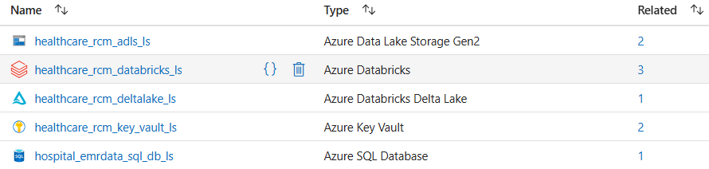
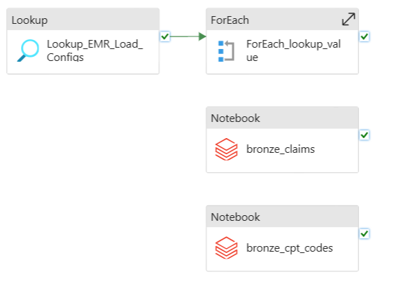
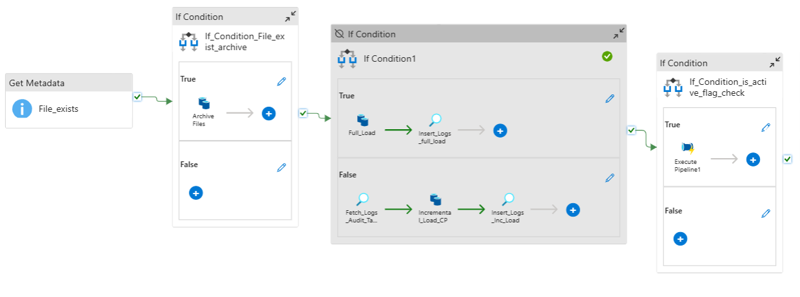
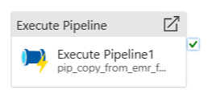
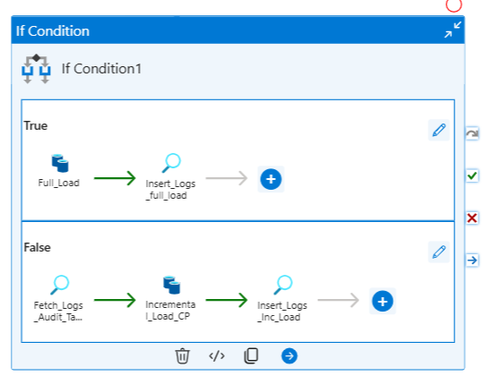

# Healthcare Revenue Cycle Management Data Engineering Project
Healthcare Revenue Cycle Management End-to-End Data Engineering Project on Azure

## Project Overview:
This project is a **metadata-driven data engineering solution** tailored for **Healthcare Revenue Cycle Management (RCM)**. Built on **Microsoft Azure**, the pipeline is designed to automate and optimize data ingestion, transformation, and historical data management processes while ensuring scalability and security.

### Key Highlights:
1. **Azure Services Utilized for the Project's Implementation:**
    - **Azure SQL Database:** Stores **EMR (Electronic Medical Record)** data of hospitals
    - **Azure Data Factory (ADF):** Orchestrates seamless data workflows.
    - **Azure Databricks:** Performs advanced transformations, data cleansing, and analytics with Unity Catalog for data governance.
    - **Azure Data Lake Storage Gen2:** Serves as a centralized repository for raw and processed data.
    - **Azure Key Vault:** Secures sensitive information like connection strings and API keys.

2. **Various Datasources Involved:**
    - Azure SQL Database
    - Flat Files
    - APIs

3. **Advanced Data Processing Support:**
    - **Full Load** : Ingests entire datasets.
    - **Incremental Load** : Updates data incrementally to optimize processing.
    - Implements **Slowly Changing Dimensions (SCD2)** for tracking historical changes.
    - Archives historical data for compliance and auditing.
    - **Metadata-Driven Flexibility** : Configurable pipeline parameters, source mappings, and transformation rules managed via metadata for agility and reduced hardcoding.
    - **Unity Catalog Integration** : Ensures fine-grained access control, centralized governance, and secure data sharing in Azure Databricks.
  
### Key Benefits: 
- **Healthcare-Focused** : Built to meet the specific needs of Healthcare RCM processes.
- **Scalable and Secure** : Leverages Azure's robust infrastructure for high performance and data security.
- **Automated and Adaptable** : Reduces manual efforts and allows quick adaptation to new requirements.

## Overview of Healthcare Revenue Cycle Managememt (RCM):
**Healthcare Revenue Cycle Management (RCM)** refers to the comprehensive process within a healthcare organization that tracks and manages all financial transactions related to patient care, from the initial appointment scheduling to the final payment collection, ensuring accurate billing and timely receipt of revenue for services rendered; it involves a series of coordinated steps including patient registration, insurance verification, charge capture, claims submission, coding, denial management, and patient collections, aiming to optimize revenue while minimizing administrative burdens and maximizing operational efficiency.
### Purpose:
To streamline the billing process, reduce claim denials, accelerate payment collection, and maximize the healthcare provider's financial viability. 
### Key Stages:
    - Patient Registration and Eligibility Verification: Gathering patient demographics, insurance information, and verifying coverage eligibility. 
    - Charge Capture: Recording all services provided to the patient, including procedure codes and charges. 
    - Coding: Assigning accurate medical codes to patient services to ensure proper billing. 
    - Claims Submission: Electronically submitting claims to insurance companies for payment. 
    - Claims Adjudication and Denial Management: Reviewing claim rejections, identifying reasons for denials, and taking corrective actions to resubmit claims. 
    - Patient Collections: Managing outstanding patient balances through billing and collection activities. 

Here is the links to understand more about Healthcare Account Receivable Management:
[healthcare-accounts-receivable-management](https://mdmanagementgroup.com/healthcare-accounts-receivable-management/)

## Solution Architecture of the Project

## ER Diagram

## Implementation
---
### Source Data:
We are generated the **EMR data** and **Claims data** using the **Faker Module**. **CPT codes** were provided, **NPI and ICD codes data** were extracted from the **Public APIs**. The various data files along with the file type and source location are mentioned below:

| File Name | Source Location / File Type |  
|-----------|-----------------------------|
| Patients | Azure SQL Database |
| Providers	| Azure SQL Database |
| Departments | Azure SQL Database |
| Transactions | Azure SQL Database |
| Encounters | Azure SQL Database |
| Claims | Landing / CSV |
| CPT Codes | Landing / CSV |
| NPI Extract | Bronze / Parquet |
| ICD Codes | Bronze / Parquet |
| Load Configs | configs / CSV |

**EMR data** comprises of 'Patients', 'Providers', 'Departments', 'Transactions' and 'Encounters' collectively and each of the following hosptipal's Azure SQL Databases have there own separate EMR datasets in the tables:
1. **healthcare-rcm-hospital-a**
2. **healthcare-rcm-hospital-b**

As mentioned, our pipeline will be a metadata driven pipeline, hence, the **load_confgs** for the emr data ingestion is stored in **configs container** in ADLS in the csv format.

**[load_config](Datasets/load_config.csv)**

### Setup:
#### Security & Governance:
- Created Azure Key Vault
- App Registration for Azure Databricks and Azure Data Factory
- Adding all the secrets to Azure Key Vault
- Created the Databricks Secret Scope and linked Azure Key Vault to it.
- Given **'Get/list'** Access to Secrets in Key Vault to the registered applications.
#### Mounts to ADLS:
- Get secrets in the notebook using **dbutils.secrets.get**
- Created mounts to the containers in ADLS **( Landing, Bronze, Silver, Gold, Configs )**

    **Script :** [Mounts_Creation](Set_up/adls_mounts.py)
#### Unity Catalog setup and Schema creation:
- Configured Unity Catalog and linked it to a metastore stored in ADLS.
- Established a catalog within Databricks.
- Created schemas (databases) including Audit, Silver, and Gold for structured organization. 
- All Delta tables are housed within their respective schemas under Unity Catalog.

    **Scripts:**
    * [Schemas](Set_up/Schemas.py)
    * [Audit_ddl](Set_up/audit_ddl.py)
  
### Data Collection:
- **EMR and Claims Data Generation:** EMR data and claims data were simulated using the **Faker module** in Azure Databricks.
- **EMR Data Upload:** EMR data, initially generated in **CSV** format, was uploaded to respective **hospitals' Azure SQL Databases** via **Azure Data Studio.**
- **Claims Data Handling:** Claims data, generated in **CSV** format, was stored in the **'landing'** container of Azure Data Lake Storage (**ADLS**).
- **CPT Codes Data:** Provided as a flat file, CPT codes were initially stored in the **'landing'** container of **ADLS**.
- **NPI and ICD Codes Data:** Generated in Databricks by connecting to publicly available **APIs** and directly saved as **Parquet** files in the Bronze container of ADLS.

    **Scripts:** 
    * [EMR_Claims_Data_Generator_Faker_Module](Data_Generator/data_generator_faker_module.py)
    * [ICD_Code_API_Extract](API_Extracts/ICD_Code_API_Extract.py)
    * [NPI_API_Extract](API_Extracts/NPI_API_Extract.py)
    * [CPT_Codes](Datasets/cptcodes/cptcodes.csv)

### Data Ingestion:
- Linked services has been created to the respective azure services to integrate data movement from source to target.
  
- Respective datasets have been created in ADF.
- **EMR, Claims and CPT codes** data have been ingested and brought to bronze layer using the ADF pipeline:
    1. A lookup activity to read the load_configs file.
    2. ForEach activity to iterate over each value in the load_configs file and do the processing for each entries.
    3. Databricks notebook has been included as an independent activities to ingest and bring claims and cpt_codes data from landing to bronze layer in parquet format.

       
    4. Inside ForEach activity, the follwoing activities are present;

       
    5. Get Metadata activities for each entries check whether the file is present in the bronze container or not.
    6. If the file Exists, then the True section of the If condition activity will execute, then it will copy the existing file to the archive folder in the bronze layer.
    7. If not exists, do nothing.
    8. Next, is the if condition activity where if the **@equals(item().loadtype, 'Full')** then it will copy the data to the bronze container in parquet format based on the query given below-

       **@concat('Select *,''', item().datasource,''' as datasource from ', item().tablename)***
    
    9. Thereafter update the load_logs table in the databricks datalake.
    10. If the load_type != 'Full' i.e., the **False** condition of the IF condition will execute where the load_type = incremental will be taken into consideration.
    11. First a lookup activity will see the load_log table in delta lake to see the last_fetched_date based on the following query -

        **@concat('select coalesce(cast(max(loaddate) as date),''','1900-01-01',''') as last_fetched_date from healthcare_rcm_catalog.audit.load_logs where',' data_source=''',item().datasource,''' and                         tablename=''',item().tablename,'''')**
    12. Based on the last_fetched_date the incremental load will be initiated based on the following query -
 
        **Source:**
        **@concat('select *,''',item().datasource,''' as datasource from ',item().tablename,' where ',item().watermark,' >= ''',activity('Fetch_Logs_Audit_Table').output.firstRow.last_fetched_date,'''')***

    13. After loading the data into bronze layer, load_logs table will be updated:

        **@concat('insert into healthcare_rcm_catalog.audit.load_logs(data_source,tablename,numberofrowscopied,watermarkcolumnname,loaddate) values (''',item().datasource,''',                                                 ''',item().tablename,''',''',activity('Incremental_Load_CP').output.rowscopied,''',''',item().watermark,''',''',utcNow(),''')')**
    14. The 3rd if condition activity is there in the pipeline to check the condition **is_active** in the load_configs for the data load.
    15. If the **is_active = 1** then the loading will be initiated based on the load_type = full or incremental.
    16. For this implementation, in the True section of the if_condition activity **(@equals(item().is_active,'1'))** there is an execute pipeline activity which will trigger a pipeline holding the below if              condition activity similar to the Full and incremental load if condition activity explained between point 8-13.
        
        
        

### Data movement from Bronze to Silver:
In this section we have made the following implementation in the Azure Databricks:
- **Transformations** were applied to the data files.
- **Comman Data Model (CDM)** has been implemented.
- **SCD2** implementation has been made to support incremental load without loosing the history of data.
- **Quality check** was has integrated to **quarantine** the unhealthy data.
- All the data were stored in the **Delta Lakes** in databricks which helped us to achieve the below requirememts:
    - Ability to delete individual records.
    - Ability to see history and time travel.
    - Ability to roll back to a previous version.

### Data movement from Silver to Gold:
- **Final aggregation and transformations** were applied.
- **Dimension and Fact tables** were created in the Delta Lake based on the Data model requirement.

### ADF End-to-End Pipeline:
- Below are the pipelines created and there components to automate the entire process starting from **[data generation -> data ingestion -> data transformation and aggregation -> data load to Delta Lake Tables]**
    1. **pip_src_to_bronze**

        

    - Inside ForEach Activity - 
    - Inside If_Condition_Is_Active_Flag_check - 
    - Inside the execute pipeline activity - 
