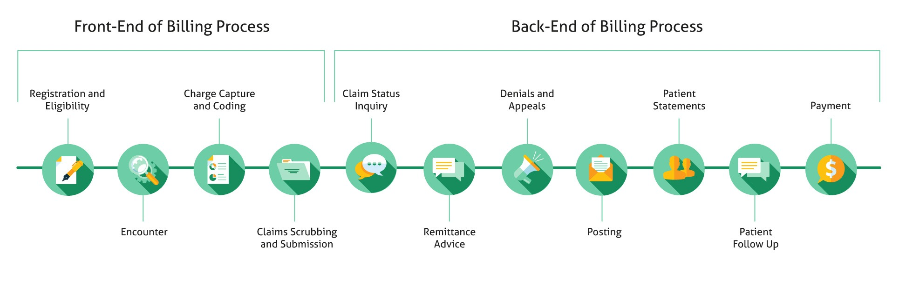
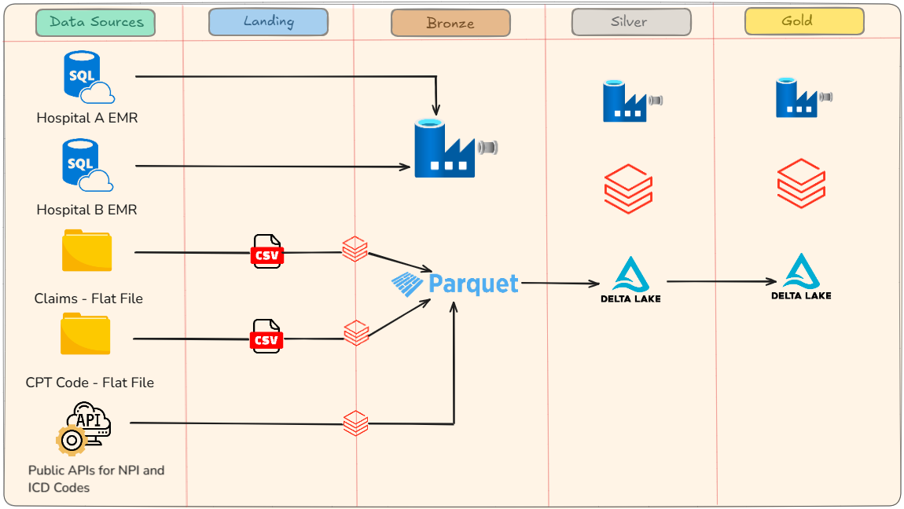
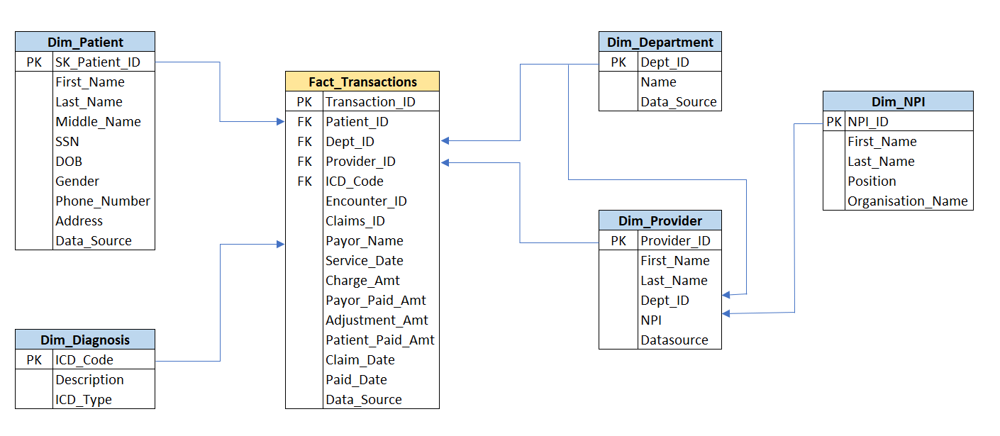

# Healthcare Revenue Cycle Management Data Engineering Project
Healthcare Revenue Cycle Management End-to-End Data Engineering Project on Azure

## Project Overview:
This project is a **metadata-driven data engineering solution** tailored for **Healthcare Revenue Cycle Management (RCM)**. Built on **Microsoft Azure**, the pipeline is designed to automate and optimize data ingestion, transformation, and historical data management processes while ensuring scalability and security.

### Key Highlights:
1. **Azure Services Utilized for the Project's Implementation:**
    - **Azure SQL Database:** Stores **EMR (Electronic Medical Record)** data of hospitals
    - **Azure Data Factory (ADF):** Orchestrates seamless data workflows.
    - **Azure Databricks:** Performs advanced transformations, data cleansing, and analytics with Unity Catalog for data governance.
    - **Azure Data Lake Storage Gen2:** Serves as a centralized repository for raw and processed data.
    - **Azure Key Vault:** Secures sensitive information like connection strings and API keys.

2. **Various Datasources Involved:**
    - Azure SQL Database
    - Flat Files
    - APIs

3. **Advanced Data Processing Support:**
    - **Full Load** : Ingests entire datasets.
    - **Incremental Load** : Updates data incrementally to optimize processing.
    - Implements **Slowly Changing Dimensions (SCD2)** for tracking historical changes.
    - Archives historical data for compliance and auditing.
    - **Metadata-Driven Flexibility** : Configurable pipeline parameters, source mappings, and transformation rules managed via metadata for agility and reduced hardcoding.
    - **Unity Catalog Integration** : Ensures fine-grained access control, centralized governance, and secure data sharing in Azure Databricks.
  
### Key Benefits: 
- **Healthcare-Focused** : Built to meet the specific needs of Healthcare RCM processes.
- **Scalable and Secure** : Leverages Azure's robust infrastructure for high performance and data security.
- **Automated and Adaptable** : Reduces manual efforts and allows quick adaptation to new requirements.

## Overview of Healthcare Revenue Cycle Managememt (RCM):
**Healthcare Revenue Cycle Management (RCM)** refers to the comprehensive process within a healthcare organization that tracks and manages all financial transactions related to patient care, from the initial appointment scheduling to the final payment collection, ensuring accurate billing and timely receipt of revenue for services rendered; it involves a series of coordinated steps including patient registration, insurance verification, charge capture, claims submission, coding, denial management, and patient collections, aiming to optimize revenue while minimizing administrative burdens and maximizing operational efficiency.
### Purpose:
To streamline the billing process, reduce claim denials, accelerate payment collection, and maximize the healthcare provider's financial viability. 
### Key Stages:
    - Patient Registration and Eligibility Verification: Gathering patient demographics, insurance information, and verifying coverage eligibility. 
    - Charge Capture: Recording all services provided to the patient, including procedure codes and charges. 
    - Coding: Assigning accurate medical codes to patient services to ensure proper billing. 
    - Claims Submission: Electronically submitting claims to insurance companies for payment. 
    - Claims Adjudication and Denial Management: Reviewing claim rejections, identifying reasons for denials, and taking corrective actions to resubmit claims. 
    - Patient Collections: Managing outstanding patient balances through billing and collection activities. 

Here is the links to understand more about Healthcare Account Receivable Management:
[healthcare-accounts-receivable-management](https://mdmanagementgroup.com/healthcare-accounts-receivable-management/)

## Solution Architecture of the Project

## ER Diagram

## Implementation
---
### Source Data:
We are generated the **EMR data** and **Claims data** using the **Faker Module**. **CPT codes** were provided, **NPI and ICD codes data** were extracted from the **Public APIs**. The various data files along with the file type and source location are mentioned below:

| File Name | Source Location / File Type |  
|-----------|-----------------------------|
| Patients | Azure SQL Database |
| Providers	| Azure SQL Database |
| Departments | Azure SQL Database |
| Transactions | Azure SQL Database |
| Encounters | Azure SQL Database |
| Claims | Landing / CSV |
| CPT Codes | Landing / CSV |
| NPI Extract | Bronze / Parquet |
| ICD Codes | Bronze / Parquet |

**EMR data** comprises of 'Patients', 'Providers', 'Departments', 'Transactions' and 'Encounters' collectively and each of the following hosptipal's Azure SQL Databases have there own separate EMR datasets in the tables:
1. **healthcare-rcm-hospital-a**
2. **healthcare-rcm-hospital-b**

### Setup:
#### Security, Governance and Mounts to ADLS:

### Data Collection:
- **EMR and Claims Data Generation:** EMR data and claims data were simulated using the **Faker module** in Azure Databricks.
- **EMR Data Upload:** EMR data, initially generated in **CSV** format, was uploaded to respective **hospitals' Azure SQL Databases** via **Azure Data Studio.**
- **Claims Data Handling:** Claims data, generated in **CSV** format, was stored in the **'landing'** container of Azure Data Lake Storage (**ADLS**).
- **CPT Codes Data:** Provided as a flat file, CPT codes were initially stored in the **'landing'** container of **ADLS**.
- **NPI and ICD Codes Data:** Generated in Databricks by connecting to publicly available **APIs** and directly saved as **Parquet** files in the Bronze container of ADLS.

**Scripts:** 
1. [EMR_Claims_Data_Generator_Faker_Module](data_generator_faker_module.py)
2. [ICD_Code_API_Extract](ICD_Code_API_Extract.py)
3. [NPI_API_Extract](NPI_API_Extract.py)
4. [cpt_codes.csv](Datasets/cptcodes/cptcodes.csv)

### Data Ingestion:
- 
